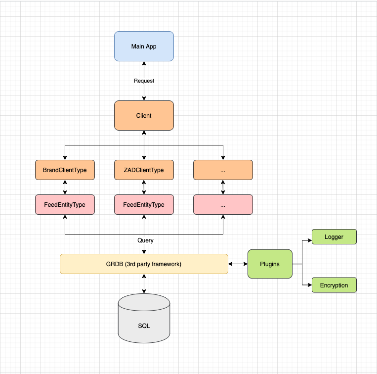

# iOS Components - Storage

In the pursuit of improving iOS codebase and migrate to new iOS architecture, we need to document each used components to be able to improve it and consolidate our foundations. This one define our storage components.

---
Storage is an database wrapper that provide functional througnt ClientType. Ideally for each type of Entity will have it's ClientType.

Each ClientType will define the specific fetch, persis or update depend on the business logic required



The template for this idea above may look like:

* Each EnityType will prepersent the data table 

```swift
public protocol BrandEntityType {
    var brandId: String { get }
    var image: String { get set}
    var keywords: String { get set}
    var name: String { get set}
}
```

* So each EntityType will has ClientType prepersent functions to access that table like save, get data by ID, delete, etc.
```swift
public protocol BrandClientType {
    func save(_ entity: BrandEntityType, for nameSpace: String) throws
    func getBrandByLanguage(_ language: String) throws -> [BrandEntityType]?
    func clearBrandBy(_ language: String) throws
    func delete(_ id: String) throws -> Int
}

public protocol ClientType {
    var brand: BrandClientType { get }
}
```

The Context will make the approriate query to database base on these ClientType's function
```swift
extension StorageContext: BrandClientType {
    public func delete(_ id: String) throws -> Int {
        return try dbQueue.inDatabase({ db in
            try Brand.filter(Column("brandId") == id).deleteAll(db)
        })
    }
    
    public func save(_ entity: Brand, for nameSpace: String) throws {
        try dbQueue.inDatabase({ db in
            try entity.insert(db)
        })
    }

    public func getBrandByLanguage(_ language: String) throws -> [BrandClientType]? {
        return try dbQueue.inDatabase { db in
            try Brand.fetchAll(db)
        }
    }
    
    public func clearBrandBy(_ language: String) throws  {
        try dbQueue.inDatabase { db in
            _ = try Brand.filter(Column("language") == language).deleteAll(db)
        }
    }
}
```

To use it in the main app, just make the call through the client
  ```swift
  let brand = Brand(...)
  try Storage.shared.storageContext?.brand.save(brand)
  ```